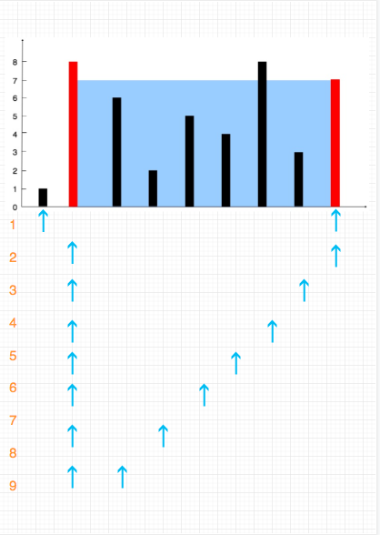

## 题目地址

https://leetcode.com/problems/container-with-most-water/description/

## 题目描述

```
Given n non-negative integers a1, a2, ..., an , where each represents a point at coordinate (i, ai). n vertical lines are drawn such that the two endpoints of line i is at (i, ai) and (i, 0). Find two lines, which together with x-axis forms a container, such that the container contains the most water.

Note: You may not slant the container and n is at least 2.
```


```

The above vertical lines are represented by array [1,8,6,2,5,4,8,3,7]. In this case, the max area of water (blue section) the container can contain is 49.


Example:

Input: [1,8,6,2,5,4,8,3,7]
Output: 49
```

## 前置知识

- 双指针

## 思路

符合直觉的解法是，我们可以对两两进行求解，计算可以承载的水量。 然后不断更新最大值，最后返回最大值即可。
这种解法，需要两层循环，时间复杂度是 O(n^2)

eg:

```js
// 这个解法比较暴力，效率比较低
// 时间复杂度是O(n^2)
let max = 0;
for (let i = 0; i < height.length; i++) {
  for (let j = i + 1; j < height.length; j++) {
    const currentArea = Math.abs(i - j) * Math.min(height[i], height[j]);
    if (currentArea > max) {
      max = currentArea;
    }
  }
}
return max;
```

可以解法效率不高，但是可以通过。那么有没有更加优的解法呢？我们来换个角度来思考这个问题，上述的解法是通过两两组合，这无疑是完备的，
那我门是否可以先计算长度为 n 的面积，然后计算长度为 n-1 的面积，... 计算长度为 1 的面积。 这样去不断更新最大值呢？
很显然这种解法也是完备的，但是似乎时间复杂度还是 O(n ^ 2), 不要着急。

考虑一下，如果我们计算 n-1 长度的面积的时候,是直接直接排除一半的结果的。

如图：



比如我们计算 n 面积的时候，假如左侧的线段高度比右侧的高度低，那么我们通过左移右指针来将长度缩短为 n-1 的做法是没有意义的，
因为`新的形成的面积变成了(n-1) * heightOfLeft 这个面积一定比刚才的长度为n的面积nn * heightOfLeft 小`

也就是说最大面积`一定是当前的面积或者通过移动短的线段得到`。

## 关键点解析

- 双指针优化时间复杂度

## 代码

- 语言支持：JS，C++,Python

JavaScript Code:

```js
/**
 * @param {number[]} height
 * @return {number}
 */
var maxArea = function (height) {
  if (!height || height.length <= 1) return 0;

  let leftPos = 0;
  let rightPos = height.length - 1;
  let max = 0;
  while (leftPos < rightPos) {
    const currentArea =
      Math.abs(leftPos - rightPos) *
      Math.min(height[leftPos], height[rightPos]);
    if (currentArea > max) {
      max = currentArea;
    }
    // 更新小的
    if (height[leftPos] < height[rightPos]) {
      leftPos++;
    } else {
      // 如果相等就随便了
      rightPos--;
    }
  }

  return max;
};
```

C++ Code:

```C++
class Solution {
public:
    int maxArea(vector<int>& height) {
        auto ret = 0ul, leftPos = 0ul, rightPos = height.size() - 1;
        while( leftPos < rightPos)
        {
            ret = std::max(ret, std::min(height[leftPos], height[rightPos]) * (rightPos - leftPos));
            if (height[leftPos] < height[rightPos]) ++leftPos;
            else --rightPos;
        }
        return ret;
    }
};
```

Python Code:

```py
class Solution:
    def maxArea(self, heights):
        l, r =  0, len(heights) - 1
        ans = 0
        while l < r:
            ans = max(ans, (r - l) * min(heights[l], heights[r]))
            if heights[r] > heights[l]:
                l += 1
            else:
                r -= 1
        return ans
```

**_复杂度分析_**

- 时间复杂度：$O(N)$
- 空间复杂度：$O(1)$

更多题解可以访问我的LeetCode题解仓库：https://github.com/azl397985856/leetcode  。 目前已经30K star啦。

关注公众号力扣加加，努力用清晰直白的语言还原解题思路，并且有大量图解，手把手教你识别套路，高效刷题。


