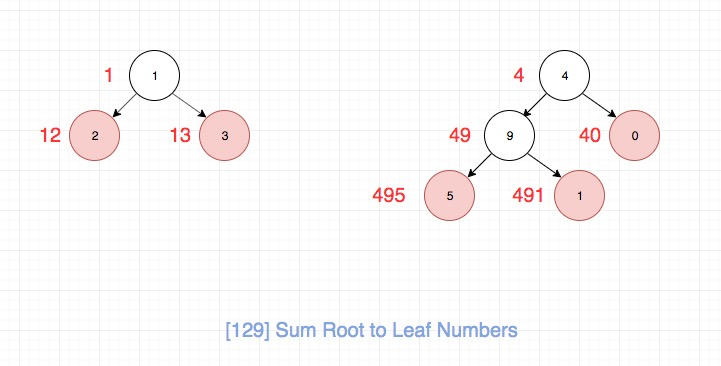
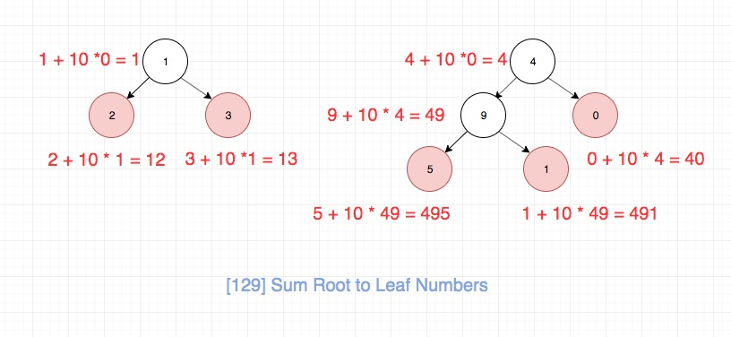

## 题目地址

https://leetcode.com/problems/sum-root-to-leaf-numbers/description/

## 题目描述

```
Given a binary tree containing digits from 0-9 only, each root-to-leaf path could represent a number.

An example is the root-to-leaf path 1->2->3 which represents the number 123.

Find the total sum of all root-to-leaf numbers.

Note: A leaf is a node with no children.

Example:

Input: [1,2,3]
    1
   / \
  2   3
Output: 25
Explanation:
The root-to-leaf path 1->2 represents the number 12.
The root-to-leaf path 1->3 represents the number 13.
Therefore, sum = 12 + 13 = 25.
Example 2:

Input: [4,9,0,5,1]
    4
   / \
  9   0
 / \
5   1
Output: 1026
Explanation:
The root-to-leaf path 4->9->5 represents the number 495.
The root-to-leaf path 4->9->1 represents the number 491.
The root-to-leaf path 4->0 represents the number 40.
Therefore, sum = 495 + 491 + 40 = 1026.

```

## 思路

这是一道非常适合训练递归的题目。虽然题目不难，但是要想一次写正确，并且代码要足够优雅却不是很容易。

这里我们的思路是定一个递归的helper函数，用来帮助我们完成递归操作。
递归函数的功能是将它的左右子树相加，注意这里不包括这个节点本身，否则会多加，
我们其实关注的就是叶子节点的值，然后通过层层回溯到root，返回即可。

整个过程如图所示：




那么数字具体的计算逻辑，如图所示，相信大家通过这个不难发现规律：



## 关键点解析

- 递归分析

## 代码

```js
/*
 * @lc app=leetcode id=129 lang=javascript
 *
 * [129] Sum Root to Leaf Numbers
 */
function helper(node, cur) {
  if (node === null) return 0;
  const next = node.val + cur * 10;

  if (node.left === null && node.right === null) return next;

  const l = helper(node.left, next);
  const r = helper(node.right, next);

  return l + r;
}
/**
 * Definition for a binary tree node.
 * function TreeNode(val) {
 *     this.val = val;
 *     this.left = this.right = null;
 * }
 */
/**
 * @param {TreeNode} root
 * @return {number}
 */
var sumNumbers = function(root) {
  // tag: `tree` `dfs` `math`
  return helper(root, 0);
};
```

## 相关题目

- [sum-of-root-to-leaf-binary-numbers](https://leetcode.com/problems/sum-of-root-to-leaf-binary-numbers/)

> 这道题和本题太像了，跟一道题没啥区别

