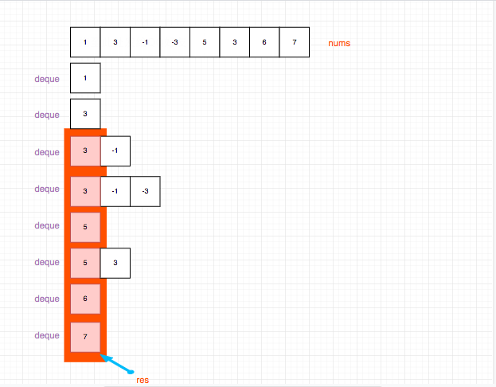

## 题目地址

https://leetcode.com/problems/sliding-window-maximum/description/

## 题目描述

```
Given an array nums, there is a sliding window of size k which is moving from the very left of the array to the very right. You can only see the k numbers in the window. Each time the sliding window moves right by one position. Return the max sliding window.

Example:

Input: nums = [1,3,-1,-3,5,3,6,7], and k = 3
Output: [3,3,5,5,6,7]
Explanation:

Window position                Max
---------------               -----
[1  3  -1] -3  5  3  6  7       3
 1 [3  -1  -3] 5  3  6  7       3
 1  3 [-1  -3  5] 3  6  7       5
 1  3  -1 [-3  5  3] 6  7       5
 1  3  -1  -3 [5  3  6] 7       6
 1  3  -1  -3  5 [3  6  7]      7
Note:
You may assume k is always valid, 1 ≤ k ≤ input array's size for non-empty array.

Follow up:
Could you solve it in linear time?
```

## 思路

符合直觉的想法是直接遍历 nums, 然后然后用一个变量 slideWindow 去承载 k 个元素，
然后对 slideWindow 求最大值，这是可以的，时间复杂度是 O(n \* k).代码如下：

```js
/**
 * @param {number[]} nums
 * @param {number} k
 * @return {number[]}
 */
var maxSlidingWindow = function(nums, k) {
  // bad 时间复杂度O(n * k)
  if (nums.length === 0 || k === 0) return [];
  let slideWindow = [];
  const ret = [];
  for (let i = 0; i < nums.length - k + 1; i++) {
    for (let j = 0; j < k; j++) {
      slideWindow.push(nums[i + j]);
    }
    ret.push(Math.max(...slideWindow));
    slideWindow = [];
  }
  return ret;
};
```

但是如果真的是这样，这道题也不会是 hard 吧？这道题有一个 follow up，要求你用线性的时间去完成。
我们可以用双端队列来完成，思路是用一个双端队列来保存`接下来的滑动窗口可能成为最大值的数`。具体做法：


- 入队列

- 移除失效元素，失效元素有两种

1. 一种是已经超出窗口范围了，比如我遍历到第4个元素，k = 3，那么i = 0的元素就不应该出现在双端队列中了
具体就是`索引大于 i - k + 1的元素都应该被清除`

2. 小于当前元素都没有利用价值了，具体就是`从后往前遍历（双端队列是一个递减队列）双端队列，如果小于当前元素就出队列`


如果你仔细观察的话，发现双端队列其实是一个递减的一个队列。因此队首的元素一定是最大的。用图来表示就是：



## 关键点解析

- 递归简化操作
- 如果树很高，建议使用栈来代替递归
- 这道题目对顺序没要求的，因此队列数组操作都是一样的，无任何区别

## 代码

```js
/*
 * @lc app=leetcode id=239 lang=javascript
 *
 * [239] Sliding Window Maximum
 *
 * https://leetcode.com/problems/sliding-window-maximum/description/
 *
 * algorithms
 * Hard (37.22%)
 * Total Accepted:    150.8K
 * Total Submissions: 399.5K
 * Testcase Example:  '[1,3,-1,-3,5,3,6,7]\n3'
 *
 * Given an array nums, there is a sliding window of size k which is moving
 * from the very left of the array to the very right. You can only see the k
 * numbers in the window. Each time the sliding window moves right by one
 * position. Return the max sliding window.
 *
 * Example:
 *
 *
 * Input: nums = [1,3,-1,-3,5,3,6,7], and k = 3
 * Output: [3,3,5,5,6,7]
 * Explanation:
 *
 * Window position                Max
 * ---------------               -----
 * [1  3  -1] -3  5  3  6  7       3
 * ⁠1 [3  -1  -3] 5  3  6  7       3
 * ⁠1  3 [-1  -3  5] 3  6  7       5
 * ⁠1  3  -1 [-3  5  3] 6  7       5
 * ⁠1  3  -1  -3 [5  3  6] 7       6
 * ⁠1  3  -1  -3  5 [3  6  7]      7
 *
 *
 * Note:
 * You may assume k is always valid, 1 ≤ k ≤ input array's size for non-empty
 * array.
 *
 * Follow up:
 * Could you solve it in linear time?
 */
/**
 * @param {number[]} nums
 * @param {number} k
 * @return {number[]}
 */
var maxSlidingWindow = function(nums, k) {
  // 双端队列优化时间复杂度, 时间复杂度O(n)
  const deque = []; // 存放在接下来的滑动窗口可能成为最大值的数
  const ret = [];
  for (let i = 0; i < nums.length; i++) {
    // 清空失效元素
    while (deque[0] < i - k + 1) {
      deque.shift();
    }

    while (nums[deque[deque.length - 1]] < nums[i]) {
      deque.pop();
    }

    deque.push(i);

    if (i >= k - 1) {
      ret.push(nums[deque[0]]);
    }
  }
  return ret;
};
```

## 扩展

### 为什么用双端队列
因为删除无效元素的时候，会清除队首的元素（索引太小了
）或者队尾(元素太小了)的元素。 因此需要同时对队首和队尾进行操作，使用双端队列是一种合乎情理的做法。
